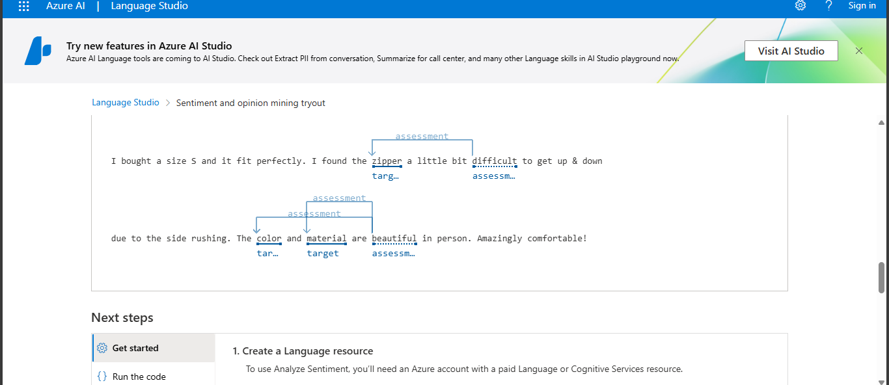

# 🧠 Análise de Sentimentos com Azure Language Studio

Este projeto faz parte do desafio proposto na plataforma DIO, onde foi utilizado o serviço **Azure Language Studio** para realizar uma análise de sentimentos de um texto em inglês. A proposta visa aplicar, na prática, os conhecimentos adquiridos sobre serviços de IA voltados para linguagem natural.

## 📌 Objetivo

Utilizar a ferramenta de **Análise de Sentimentos e Opinião** no Language Studio, identificar os sentimentos expressos no texto e documentar os resultados obtidos.

## 📝 Texto analisado

> "I bought a size S and it fit perfectly. I found the zipper a little bit difficult to get up & down due to the side rushing. The color and material are beautiful in person. Amazingly comfortable!"

## 📊 Resultados obtidos

### 🔹 Sentimento do documento
- **Sentimento geral:** `mixed` (misto)
- **Confiança:**
  - **Positivo:** 74.00%
  - **Neutro:** 1.00%
  - **Negativo:** 25.00%

### 🔹 Sentimento da primeira sentença
- **Sentimento:** `positive`
- **Confiança:**
  - **Positivo:** 95.00%
  - **Neutro:** 4.00%
  - **Negativo:** 1.00%

## 🧾 Interpretação

A análise considerou o texto como de sentimento misto, pois há elogios à experiência do produto (tamanho adequado, cor, material e conforto), mas também há uma crítica relacionada à dificuldade de uso do zíper.

## 📸 Captura de tela

## ✅ Conclusão

Este desafio demonstrou como é possível aplicar IA em tarefas de Processamento de Linguagem Natural (PLN), utilizando a nuvem da Microsoft para obter insights valiosos sobre textos, como sentimentos predominantes e opiniões embutidas.

---

